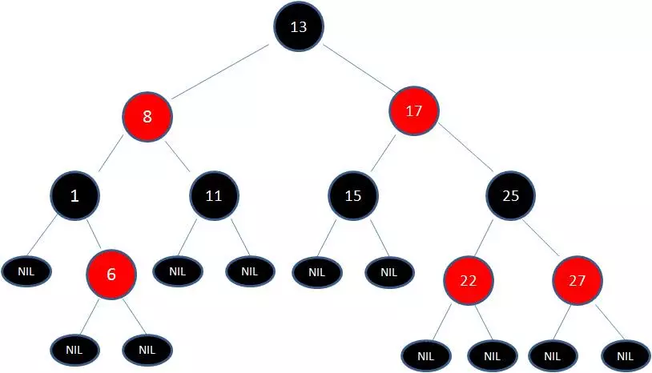

# 集合
## Arraylist 与 LinkedList 有什么不同?
线程安全：ArrayList和LinkedList都是线程不安全的。
底层数据结构：ArrayList底层是Object类型的数组，LinkedList底层是双向的链表
插入和删除是否受元素位置的影响：ArrayList底层是数组实现，所以插入删除是受位置影响的，如果在尾部插入时间复杂度是O(1),如果在中间的某个位置插入或者是删除，时间复杂度为O(n-i).LinkedList的插入或者删除不受位置影响，时间复杂度为O(1)
是否支持随机访问：ArrayList支持随机访问，LinkedList需要遍历
内存空间的占用：ArrayList的内存浪费主要体现在数组要为最后预留一定的容量空间，linkedList的内存占用主要体现在每一个节点上面，它的每一个节点都要比ArrayList消耗更多的空间
### 补充RandomAccess接口
ArrayList实现了RandomAccess接口，而LinkedList没有实现，表明了ArrayList支持随机访问，而LinkedList不支持随机访问
## ArrayList的扩容机制
无参构造ArrayList的时候，是一个空数组，当我们添加第一个元素的时候，数组的初始化大小为10，每一次扩容都是变为原来的1.5倍
## HashMap
### 知识点介绍
hashMap的数据结构(jdk1.8之前和之后)，hashMap的扰动函数，hashMap的负载因子，hashMap的rehash(扩容)，多线程问题
### jdk1.8之前
HashMap底层是数组+链表结合在一起，也就是链表散列。HashMap通过key调用hashCode方法经过扰动函数的处理获取到hash,然后进行(n-1)&hash运算，获取到数组的位置，如果当前位置没有值直接插入，如果有值，判断key是否相等，如果相等，直接覆盖，如果不相等，拉链法解决冲突。
拉链法：将链表和数组结合，每一个数组元素相当于是一个链表，发送冲突，直接添加在链表之后即可。
#### 扰动函数
扰动函数就是hash，减少hashCode的碰撞。
jdk1.8之后的hash方法
jdk1.8之前的hash方法，性能较差扰动了四次
### jdk1.8之后
在链表的个数大于8个时，转化为红黑树
### 手绘红黑树以及红黑树的理解
#### 手绘

#### 五个特性
1，每个节点是红色或者时黑色
2，根节点是黑色
3，叶子节点都是黑色的空节点
4，红节点的叶子节点都是黑色节点(不会有两个连续的红色节点)
5，从任意节点出发到叶子节点，经过的黑色节点的个数都是相同的
#### 红黑树的应用
TreeMap、TreeSet以及JDK1.8之后的HashMap底层都用到了红黑树。
#### 为什么使用红黑树？
 为了弥补搜索二叉树的缺陷，搜索二叉树有可能退化成线程接口，使得时间复杂度为O(n)
### 红黑树这么优秀,为何不直接使用红黑树得了?
红黑树属于平衡二叉树，所以维持平衡是需要代价的。我们在插入新数据之后，需要通过左旋右旋以及变色来维持红黑树的特性。
## HashMap 和 Hashtable 的区别
线程安全方面：HashMap是线程不安全的，Hashtable的方法基本都加上了同步锁，是线程安全的
性能方面：HashMap的性能笔HashTable的性能要强，HashTable基本已经被淘汰
初始化大小和扩容机制：没有制定大小的初始化，HashTable的大小是11，每次扩容都是原来的2N+1，HashMap的初始化大小是16，每次扩容是原来的二倍
null key和null value的情况：hashMap可以有一个null的key，可以有一个或者多个null的value，如果HashTable有一个null的key或者是value就会抛出异常
底层数据结构：在jdk1.8之后，hashMap链表的节点个数超过8的时候就会转化为红黑树
## HashMap的数组长度为什么是2的幂次方
Hash值的范围是40亿个数字，内存是放不下这么大的空间的，我们要将Hash值进行取模运算，我们采用的是位运算
index=Hash&(n-1),我们要让数据均匀分布，所以使用2的幂次方，使用其他的值，有的index的几率会变大，有的index的几率会变小
## HashMap和HashSet的区别
HashMap实现了map接口，HashSet实现了set接口
HashMap存储的是键值对，HashSet存储的是对象
HashMap调用的是put添加元素，HashSet调用的add添加元素
HashMap使用key来计算hashCode，HashSet使用对象来计算HashCode
## HashSet内部是如何查重的
我们在向HashSet中添加元素的时候，首先计算出它对应的hashCode，在对应的位置查看是否有hashCode相等的对象，如果没有的话，表示没有对象重复。如果有的话，我们调用equal方法一个个的比对，如果equal都为false，那么就没有重复对象
## HashMap的扩容机制
阈值=负载因子*当前的数组长度
## HashMap的多线程安全问题
在jdk1.7中，执行扩容方法时，采用的时头插法
```
next=e.next;
e.next=newTable[i];
newTable=e;
e=next;
```
扩容完之后，顺序不同了
[JAVA HASHMAP的死循环](https://coolshell.cn/articles/9606.html)
在并发执行rehash的操作的时候，因为头插法的关系，有可能形成一个循环列表。
jdk1.8之后解决了这个问题，但是在多线程的环境下仍然有可能数据丢失。所以在多线程环境下应该使用concurrentHashMap
## ConcurrentHashMap 和 Hashtable 的区别
底层数据结构：在jdk1.8之前，ConcurrentHashmap采用分段的数组+链表的形式，jdk1.8之后，摒弃了Segment(分段)，我们采用Node数组+链表/红黑树的数据结构。HashTable的数据结构和jdk1.8之前的hashMap是类似的，采用数组+链表的组织方式，数组是主体，链表是解决冲突的方式
实现线程安全的方式：
jdk1.8之前，采用分段锁的方式，我们对整个桶数组进行分割，每一把锁只是锁桶数组的一部分数据，这样当线程同时访问不同的锁的数据的时候，就不会存在竞争。在jdk1.8之后，ConcurrentHashMap摒弃了分段锁的方式，采用Node数组+链表/红黑树的方式，并发控制使用synchronized和CAS。
HashTable给整个结构加锁，一个线程在执行put操作的时候，另一个线程的put操作就会阻塞，这样会导致竞争越来越激烈，效率越来越低。
## ConcurrentHashMap线程安全的具体实现方式/底层具体实现
jdk1.7
首先将数组分成一段一段的，然后为每一段都配一把锁，当线程获取锁访问某一段的时候，其他线程可以获取锁访问其他的段。
ConcurrentHashMap的结构
```
public class Segment extent ReentrantLock 
```
一个ConcurrentHashMap其中包括一个Segment数组，一个Segment元素其中包括一个HashEntry[]数组。当我们要对HashEntry进行改变的时候，我们首先要获取到Segment的锁
jdk1.8
1.8之后的ConcurrentHashMap摒弃了分段锁的概念，使用CAS和synchronized来保证线程安全。

## 参考博客
[什么是HashMap？](https://juejin.im/post/5a215783f265da431d3c7bba)
[高并发下的HashMap](https://juejin.im/post/5a224e1551882535c56cb940)
[图解HashMap(一)](https://juejin.im/post/5a23f82ff265da432003109b#heading-11)
[图解HashMap(二)](https://juejin.im/post/5a255bbd6fb9a0450c493f4d)
[ConcurrentHashMap1.7](https://juejin.im/post/5a2f2f7851882554b837823a#heading-4)
[ConcurrentHashMap1.8](https://juejin.im/post/5b53d1adf265da0f70070e3d)